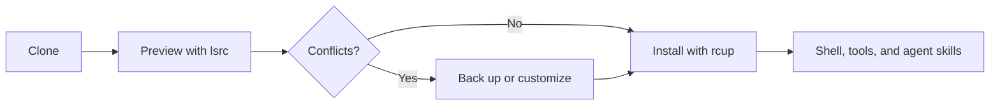

# Sajjad's dotfiles

[](https://www.apple.com/macos/)
[](https://rubyonrails.org/)
[](agents/skills/)
[](https://github.com/sajjadmurtaza/dotfiles/actions/workflows/shellcheck.yml)

**One setup. Three coding agents. Rails conventions first.**

A macOS-first development environment for Ruby on Rails and general full-stack work. It keeps shell, Git, editor, Homebrew, utility scripts, and reusable AI agent skills in one reviewable repository.

> The setup is intentionally explicit: preview links first, keep machine-specific values local, and install only what you want.

[Quick start](#quick-start) · [AI agent skills](#ai-agent-skills) · [Useful commands](#useful-commands) · [Privacy and safety](#privacy-and-safety)

## What is included

| Area | Highlights |
| --- | --- |
| Ruby and Rails | RubyGems, IRB, RSpec, Rails aliases, PostgreSQL tools, Overmind, and Rails-focused agent guidance |
| Full stack | Node.js defaults, TypeScript guidance, Docker, Caddy, GitHub CLI, and common media/network utilities |
| Shell | Zsh, Prezto support, Starship, fzf, zoxide, completions, and practical Git helpers |
| Editor and terminal | Vim, VS Code, WezTerm, Ghostty, tmux, and Tig configuration |
| macOS | Homebrew bundle and an interactive macOS defaults script |
| AI workflows | Agent skills for planning, implementation, Rails, reviews, pull requests, docs, and releases |



## Quick start

### 1. Clone

Install [Homebrew](https://brew.sh/) first, then:

```sh
mkdir -p "$HOME/work"
git clone git@github.com:sajjadmurtaza/dotfiles.git "$HOME/work/dotfiles"
cd "$HOME/work/dotfiles"
```

If you use a named SSH host such as `github-secondary`, substitute it in the clone URL.

### 2. Preview and install the links

[`rcm`](https://github.com/thoughtbot/rcm) maps repository names such as `zshrc` and `scripts/` to `~/.zshrc` and `~/.scripts/`.

```sh
brew install rcm
RCRC="$PWD/rcrc" lsrc -d "$PWD"
RCRC="$PWD/rcrc" rcup -d "$PWD" -v
```

Read the `lsrc` output and back up conflicting files before `rcup`. Do not use `rcup -f` on an existing home directory unless you deliberately want to replace conflicts.

### 3. Choose your tools

Minimal Rails/full-stack foundation:

```sh
brew install git mise overmind libpq ripgrep fzf shellcheck shfmt
```

Complete curated setup:

```sh
brew bundle --file="$PWD/Brewfile"
```

The complete bundle includes desktop applications, so review [`Brewfile`](Brewfile) before running it.

### 4. Finish the shell setup

Prezto is optional; the Zsh configuration works without it.

```sh
git clone --recursive https://github.com/sorin-ionescu/prezto.git "${ZDOTDIR:-$HOME}/.zprezto"
mkdir -p "$HOME/.zprezto-contrib" "$HOME/.vim/backups" "$HOME/.vim/swaps" "$HOME/.vim/undo"
exec zsh
```

`mise` activates automatically when installed. Pin project versions in each application's own `.tool-versions` or `mise.toml`; the versions here are workstation defaults.

## Customize without editing tracked files

Put machine-specific settings, work aliases, and secrets in `~/.zshrc.local`:

```sh
export GITHUB_USER="sajjadmurtaza"
export WORKSPACE="$HOME/work"
alias work='cd "$WORKSPACE"'
```

The repository's `zshrc` loads this file when it exists. Never commit API keys, tokens, private hostnames, or customer paths to this public repository.

## AI agent skills

Use the same reviewable engineering workflow in [Codex](https://developers.openai.com/codex/skills), [Claude Code](https://code.claude.com/docs/en/skills), and [Cursor](https://cursor.com/docs/skills). The skills guide an AI agent while it works on a repository; they are not Ruby gems, application dependencies, or production services.

The source of truth is [`agents/skills/`](agents/skills/). The collection includes `dev`, `ruby-dev`, `ruby-on-rails-dev`, `typescript-dev`, `architecture`, `code-review`, `pull-request`, and supporting workflow skills.

### Install once for all three agents

Requires Node.js (`npx`) and GitHub access:

```sh
# See the available skills
npx skills add sajjadmurtaza/dotfiles/agents/skills --list

# Install all skills globally
npx skills add sajjadmurtaza/dotfiles/agents/skills \
  -g \
  -a codex claude-code cursor \
  -y

# Verify the global installation
npx skills list -g
```

Prefer a smaller Rails-focused set:

```sh
npx skills add sajjadmurtaza/dotfiles/agents/skills \
  -g \
  -a codex claude-code cursor \
  --skill dev ruby-dev ruby-on-rails-dev code-review \
  -y
```

For one project only, run the same command from that repository and omit `-g`.

### Use a skill

| Agent | Explicit invocation | Discover or verify |
| --- | --- | --- |
| Codex | Mention `$dev`, `$ruby-dev`, or `$ruby-on-rails-dev` | Run `/skills`; restart Codex if a new skill does not appear |
| Claude Code | Run `/dev`, `/ruby-dev`, or `/ruby-on-rails-dev` | Run `/skills`; restart only when the top-level skills directory was created after the session started |
| Cursor | Choose `/dev` or `/ruby-on-rails-dev` from the slash-command menu | Type `/` in Agent chat and find the skill |

The agents can also select a skill automatically when your request matches its description. Explicit invocation is useful when you want a predictable workflow.

### Try the Rails workflow

Paste this into Codex, Claude Code, or Cursor:

```text
Use the dev, ruby-dev, and ruby-on-rails-dev skills to add account suspension.
Follow the existing Rails architecture, keep the change KISS, add regression tests,
run the repository's native validation, and finish with the code-review skill.
```

The intended path is:

```text
request → dev → ruby-dev → ruby-on-rails-dev → code-review → pull-request
```

When this repository is installed through `rcm`, the skills are also linked into `~/.agents/skills/`, which Codex and Cursor read as a user-level skill location. The `npx skills` command above also creates the Claude Code links. See the [skill catalog and composition guide](agents/skills/README.md) for project-level installation, detailed routing, and the complete skill index.

## Useful commands

| Command | Purpose |
| --- | --- |
| `RCRC="$PWD/rcrc" lsrc -d "$PWD"` | Preview source-to-home mappings with this repository's exclusions |
| `RCRC="$PWD/rcrc" rcup -d "$PWD" -v` | Install or refresh reviewed links |
| `brew bundle --file="$PWD/Brewfile"` | Install the complete tool collection |
| `./scripts/macos-defaults-apply` | Interactively review and apply macOS preferences |
| `./scripts/playground` | Find or create a development playground with fzf |
| `./scripts/skill doctor` | Check the local agent-skill store for drift |
| `make -C skill lint test` | Validate the skill-store CLI |

## Safe backups

Backup scripts contain no personal servers or cloud destinations. They refuse to run without an explicit destination and default to a dry run.

```sh
# Preview an SSH music backup
MUSIC_SSH_BACKUP_DESTINATION='user@backup-host:/path/to/music' \
  ./scripts/backup-music-local

# Preview an rclone music backup
MUSIC_RCLONE_DESTINATION='my-remote:backups/music' \
  ./scripts/backup-music-remote

# Preview a system backup to a mounted external volume
SYSTEM_BACKUP_DIR='/Volumes/MyBackup' ./scripts/backup-system
```

After reviewing the exact changes, add `BACKUP_APPLY=1` to perform the transfer. The scripts use synchronization with deletion, so the preview is an essential safety step.

## macOS preferences

Run the guided script and approve only the settings you want:

```sh
./scripts/macos-defaults-apply
```

Settings such as Apple Watch unlock, trackpad gestures, accessibility colors, and the screenshot location remain manual in System Settings. Touch ID for `sudo` also requires a deliberate edit to `/etc/pam.d/sudo`; it is not changed automatically.

## Repository map

```text
agents/skills/   reusable engineering and product agent skills
config/          application configuration linked under ~/.config
scripts/         command-line helpers linked as ~/.scripts
skill/           Ruby CLI that manages the local skill store
vim/             Vim runtime directories and plugins
Brewfile         optional complete Homebrew bundle
profile, zshrc   shared shell environment and interactive Zsh setup
rcrc             rcm installation rules
```

## Updating

```sh
cd "$HOME/work/dotfiles"
git pull --ff-only
RCRC="$PWD/rcrc" lsrc -d "$PWD"
RCRC="$PWD/rcrc" rcup -d "$PWD" -v
```

Topgrade may update installed tools, but repository pulls and `rcup` remain manual so configuration changes are always reviewed first.

## Privacy and safety

- No telemetry, remote reporting, or owner-controlled runtime service is configured by these dotfiles.
- A Git remote is only used when you explicitly run Git commands; it does not grant the repository owner access to your machine.
- Backup destinations are supplied at runtime and are never embedded in the repository.
- macOS changes, package installation, repository updates, and home-directory links require explicit commands.
- As with any public dotfiles repository, read scripts and diffs before running them and keep local secrets outside version control.

## Use responsibly

Review every system-level command for your own machine and environment. This repository does not currently declare an open-source license.
