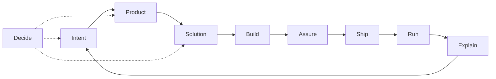

# Agent skills

**One engineering workflow for Codex, Claude Code, and Cursor.**

This is a portable skill store for product and engineering work: domain routers (Build entry: `dev`), Solution craft (`architecture`), and thin language adapters/overlays under `agents/skills/`. Vocabulary: [`CONTEXT.md`](CONTEXT.md).

## Install

### Global — recommended for personal use

```sh
npx skills add ./agents/skills \
  -g \
  --copy \
  -a codex -a claude-code -a cursor \
  --skill dev ruby-dev ruby-on-rails-dev code-review pull-request \
  -y
```

Run this from the dotfiles repository root. It installs the core workflow once for every repository and requires Node.js (`npx`). Open a new agent task/session after installation.

```sh
npx skills list -g
```

> [!IMPORTANT]
> Install globally once per machine. The same installation is available from every repository.

### Update global skills

```sh
npx skills update -g -y
npx skills list -g
```

To update only part of the workflow:

```sh
npx skills update code-review dev ruby-dev ruby-on-rails-dev pull-request -g -y
```

> [!TIP]
> Open a new agent task/session after updating. For unpushed local store edits, rerun the global install command above from the dotfiles repository root; the update command follows the recorded published source.

### Project-local — optional and repository-specific

Run from the target repository, set the source to the published dotfiles repository, and omit `-g`:

```sh
DOTFILES_SKILLS_SOURCE="https://github.com/your-account/dotfiles/tree/main/agents/skills"
npx skills add "$DOTFILES_SKILLS_SOURCE" \
  --copy \
  -a codex -a claude-code -a cursor \
  --skill dev ruby-dev ruby-on-rails-dev code-review pull-request \
  -y
```

Commit the generated agent files only when the team agrees to maintain them in that repository. A personal global installation does not need to be repeated per repository.

> [!WARNING]
> Project-local copies are repository-owned dependencies. Add them only when the team has agreed to review and update them.

| Intent | Command |
| --- | --- |
| Browse | `npx skills add ./agents/skills --list` from the dotfiles repository root |
| Project-level | Run the add command from the target repository without `-g` |
| Specific skills | Add `--skill <name ...>`, such as `--skill code-review docs` |
| This machine | Use the global command above → `~/.agents/skills/<name>/` |

The Skills CLI accepts a local skill-store path or a GitHub repository path ending in `agents/skills`. CLI: [vercel-labs/skills](https://github.com/vercel-labs/skills).

## Use

Agents load matching skills automatically from their descriptions, or you can select them explicitly.

| Agent | Invoke | Inspect installed skills |
| --- | --- | --- |
| [Codex](https://developers.openai.com/codex/skills) | Mention `$dev`, `$ruby-on-rails-dev`, or another `$skill-name` | `/skills` |
| [Claude Code](https://code.claude.com/docs/en/skills) | Run `/dev`, `/ruby-on-rails-dev`, or another `/skill-name` | `/skills` |
| [Cursor](https://cursor.com/docs/skills) | Select `/dev`, `/ruby-on-rails-dev`, or another skill from the slash-command menu | Type `/` in Agent chat |

### Rails example

```text
Use the dev, ruby-dev, and ruby-on-rails-dev skills to implement this change.
Follow the repository's Rails conventions, keep the solution KISS, add focused tests,
run the native validation commands, and finish with the code-review skill.
```

Start Build work with `dev`; it routes Rails changes through `ruby-dev` and `ruby-on-rails-dev`. Use `code-review` for the assurance pass and `pull-request` when the verified change is ready to publish.

> Claude Code note: this collection's personal `code-review` skill takes precedence over Claude's bundled skill with the same name. The bundled `/review` alias remains separate.

## Pipeline



## Domain map

| Domain       | Job                              | Skill(s)                                                                                                                    | Primary branches                                                                                                                        |
| ------------ | -------------------------------- | --------------------------------------------------------------------------------------------------------------------------- | --------------------------------------------------------------------------------------------------------------------------------------- |
| **Intent**   | Fuzzy need → actionable work     | `prompt-synthesis`; `jira-ticket`                                                                                           | `code` \| `architecture` \| `product` (default: Shared prep)                                                                            |
| **Product**  | What to build; admit/defer scope | `product-owner`                                                                                                             | `gate` (default); stubs: prioritize, story-slice, experiment                                                                            |
| **Solution** | How the system should work       | `architecture`; `docs` **`architecture`** (verify-only); `dev` **`plan`** (implementation-plan carrier)                     | craft: `deep-modules` \| `refactor-types` \| `refactor-boundaries` \| `performance`; survey: `structure-survey`; plan: `dev` **`plan`** |
| **Build**    | Change the codebase              | `dev` (router); adapters `ruby-dev`, `rust-dev`, `swift-dev`, `typescript-dev`; overlays `ruby-on-rails-dev`, `swiftui-dev` | `plan` \| `implement`; classify: surgical \| design \| review-hand-off                                                                  |
| **Assure**   | Safe to merge?                   | `code-review`                                                                                                                | `findings`, `publish`, `quality` (lenses: tests, perf, security, legacy)                                                                |
| **Ship**     | Land on mainline                 | `pull-request`; `release`                                                                                                   | PR: open, slice, comment, reply, resolve; release: `notes`                                                                              |
| **Explain**  | Humans understand state          | `communication`; `docs`                                                                                                     | see skill branches                                                                                                                      |
| **Decide**   | Stress-test choices              | `grilling` (third-party); `product-owner` Forced Challenge                                                                  | —                                                                                                                                       |

Published Build overlays: `ruby-on-rails-dev`, `swiftui-dev`. `rust-dev` can compose with compatible Rust depth packs when they are installed separately.

## Optional packs (not OS SoT)

Third-party helpers outside the domain routers. Not OS source of truth; not in the store install above.

```sh
npx skills add https://github.com/mattpocock/skills --skill grilling -g -a cursor -a codex -y && \
npx skills add https://github.com/twostraws/swiftui-agent-skill --skill swiftui-pro -g -a cursor -a codex -y && \
npx skills add https://github.com/twostraws/swift-testing-agent-skill --skill swift-testing-pro -g -a cursor -a codex -y && \
npx skills add https://github.com/arjitj2/swiftui-design-principles --skill swiftui-design-principles -g -a cursor -a codex -y
```

| Pack                        | When                           | Role                                                            |
| --------------------------- | ------------------------------ | --------------------------------------------------------------- |
| `grilling`                  | Stress-test a plan or decision | Upstream Decide skill                                           |
| `swiftui-pro`               | SwiftUI review depth           | Compose via `$dev` + `swiftui-dev`; depth pack, not Build entry |
| `swift-testing-pro`         | Swift Testing depth            | Compose via `$dev` + `swift-dev`; depth pack, not Build entry   |
| `swiftui-design-principles` | Spacing, typography, materials | Compose via `$dev` + `swiftui-dev`; depth pack, not Build entry |

More: [skills.sh](https://skills.sh/). Swift catalog: [Swift-Agent-Skills](https://github.com/twostraws/Swift-Agent-Skills).

## Compose / handoffs

**Build path (runtime):** `$dev` ⇄ `architecture` → `code-review` → `pull-request`. `$dev` is the only Build entry; `architecture` is shift-left craft inside Build — Solution-before-Build in the domain map is conceptual, not a second entrypoint.

One-way rules (prevent domain collisions):

1. **Product before non-trivial scope** — `jira-ticket` / feature asks load `product-owner` **`gate`**. Impl continues only on **Build Now** → `$dev` only (classifies; loads `architecture` when design). Skip for pure bug fix, refactor, infra. Product is gate-only this pass (stubs unauthored).
2. **Craft ≠ product** — `architecture` / `dev` / `*-dev` / `code-review` never answer “should we build X?”
3. **Build entry is `$dev`** — classify / route / phase commits live there. Class `design` → `architecture` (branch pick inside); do not inline craft in `dev` or `*-dev`. Multi-load `{lang}-dev` from **touched-file** evidence when a change spans runtimes. Packs: Stop — read `$dev` Shared prep before any delta.
4. **Implementation plans → `$dev` `plan`** — when writing an implementation plan (including Cursor plan mode), invoke `$dev` branch **`plan`** and load [`dev/reference/plan-pipeline.md`](dev/reference/plan-pipeline.md). Plan mode: product stance section only — `/product-owner` explicit for admission. `jira-ticket` Planning Checkpoint emits via `$dev` **`plan`** when phases/commits matter.
5. **Phase CC → merge → notes** — Solution/Build plan phases author Conventional Commits (validate → ≥1 CC + rationale) via `architecture` Shared prep and `$dev` — by default off the default branch; ask early when on default. After merge, `release` **`notes`** consumes history. At PR open, `pull-request` **`open`** applies the same format only if the tree is still dirty. Format SoT: [`CONTEXT.md`](CONTEXT.md).
6. **Assure → Ship** — `findings` never posts; `publish` (e2e → GitHub `COMMENT`) lives under `code-review`; verified-ledger posting lives under `pull-request` **`comment`** — never reverse those two. After Build delivery from a plan, spawn `code-review` **`findings`** (security/quality when in scope) before reporting done; if subagent unavailable, fresh in-session pass. If user asked to land and readiness is Yes/Conditional → `pull-request` **`open`**.
7. **Explain → docs** — `communication` → `docs` **`editor`** when the artifact is a README/runbook, not a message. Never reverse. `docs` **`architecture`** is Solution-adjacent verify-only (no HLD/ADR author).
8. **Overlay via `$dev` route** — `ruby-on-rails-dev` with `ruby-dev`; `swiftui-dev` with `swift-dev` (loaded by `$dev`, not as competing Build entries). Depth packs stay on pack **Compose routes**.
9. **Decide** — `grilling` stress-tests Intent / Product / Solution; product doctrine stays with `product-owner` when the topic is scope.
10. **API-truth soft deps** — API truth assumes Dash and/or Context7; if neither is available, agents warn once on first material API fallthrough then fall back (do not invent APIs). See `$dev` / [`CONTEXT.md`](CONTEXT.md).
11. **Observability cue** — APM / error tracking / logging via matching MCP when links appear; not a vendor SoT under Build.

## Skill index

| Domain   | Skills                                                                                                                                                                                                                                                                    |
| -------- | ------------------------------------------------------------------------------------------------------------------------------------------------------------------------------------------------------------------------------------------------------------------------- |
| Intent   | [`prompt-synthesis`](prompt-synthesis/), [`jira-ticket`](jira-ticket/)                                                                                                                                                                                                    |
| Product  | [`product-owner`](product-owner/)                                                                                                                                                                                                                                         |
| Solution | [`architecture`](architecture/), [`docs`](docs/)                                                                                                                                                                                                                          |
| Build    | [`dev`](dev/), [`ruby-dev`](ruby-dev/), [`rust-dev`](rust-dev/), [`swift-dev`](swift-dev/), [`typescript-dev`](typescript-dev/), [`ruby-on-rails-dev`](ruby-on-rails-dev/), [`swiftui-dev`](swiftui-dev/) |
| Assure   | [`code-review`](code-review/)                                                                                                                                                                                                                                               |
| Ship     | [`pull-request`](pull-request/), [`release`](release/)                                                                                                                                                                                                                    |
| Explain  | [`communication`](communication/), [`docs`](docs/)                                                                                                                                                                                                                        |
| Decide   | `grilling` (third-party — [Optional packs](#optional-packs-not-os-sot))                                                                                                                                                                                                   |

## Authoring laws

- **One router per domain** — branches for verb-paths; progressive load.
- **Freeze the router** — harvest via staging → sparse-promote onto `reference/<branch>.md`; edit `SKILL.md` only when the contract is wrong.
- **Compose across domains** with one-way handoffs (above).
- **Thin `*-dev`** — craft stays in `architecture`; shared classify/workflow/phase commits stay on `$dev`; overlays are deltas only.
- **Phase commits on `dev`** — Build carrier is `$dev` Shared prep (cite [`CONTEXT.md`](CONTEXT.md)); overlays never copy it. `{lang}-dev` packs add language deltas only. Solution craft phases still commit via `architecture` Shared prep.
- **Proliferation guard** — new top-level skill only if it cannot be a branch of an existing router (for refactor concerns: `refactor-<concern>` under `architecture`, never bare `refactor` or a parallel `product` skill). Runtime route table stays in frozen `dev/SKILL.md` (contract edit for new langs — not a parallel registry).

Router shape: `## Pick branch` → `## Shared prep` → `## Branch reference` → `## Handoff` → `## Completion criteria`. Relative `reference/*.md` links; unnumbered `##` headers. Terms: [`CONTEXT.md`](CONTEXT.md). Spec: [agentskills.io](https://agentskills.io/).

## Operate the store

Git-tracked trees under `agents/skills/<name>/` are the source of truth. Install published skills with the global command above. During local skill development, run the same command against `./agents/skills` from the dotfiles checkout, review the installed result, and open a new agent task/session.

**CONTEXT:** vocabulary SoT lives at store root [`CONTEXT.md`](CONTEXT.md) (`<dotfiles-directory>/agents/skills/CONTEXT.md`). Skills cite `../CONTEXT.md` relative to the store tree; that path is not installed under `~/.agents/skills/<name>/`. When working outside the dotfiles workspace, read CONTEXT from the store root (or open this repo) — do not copy it into each skill.

| Command                    | Role                                                                  |
| -------------------------- | --------------------------------------------------------------------- |
| `skill list`               | List non-hidden skills in the store                                   |
| `skill doctor`             | Report `ok` / `drift` / `home-only` / `broken` for store vs install   |
| `skill backfill <name>`    | Copy drifted real files from `~/.agents/skills/<name>` into the store |
| `skill promote <name>`     | Move `<project>/.agents/skills/<name>` into the store                 |
| `skill rename <old> <new>` | Rename in the store                                                   |
| `npx skills add ./agents/skills -g --copy -a codex -a claude-code -a cursor -y` | Install the local store globally |

When `skill doctor` reports `drift`, decide which side is authoritative before backfilling or reinstalling; never overwrite reviewed changes blindly.

| Scope         | Path                                             |
| ------------- | ------------------------------------------------ |
| Store         | `agents/skills/<name>/` in this repo             |
| Agent install | `~/.agents/skills/<name>/` via the Skills CLI    |
| Project draft | `<repo>/.agents/skills/<name>/` (promote source) |
