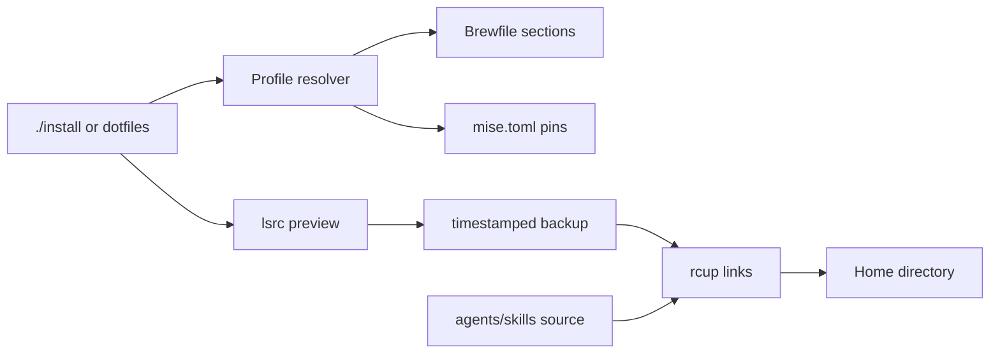

# Architecture

This repository has three deliberately separate responsibilities: provision tools, link reviewed configuration, and distribute agent skills. Each fact has one owner.

## Ownership

| Concern | Source of truth | Consumer |
| --- | --- | --- |
| setup behavior | `lib/dotfiles.rb` | `install`, `scripts/dotfiles` |
| package membership | profiled sections in `Brewfile` | Homebrew Bundle through the setup CLI |
| runtime versions | `mise.toml` | mise; exact pins make a cross-platform lockfile unnecessary |
| source-to-home mapping | repository layout plus `rcrc` | `lsrc`, `rcup` |
| agent workflows | `agents/skills/<name>/` | Codex, Claude Code, Cursor |
| machine identity/secrets | untracked `~/.gitconfig.local`, `~/.profile.local`, `~/.zshrc.local` | Git and the shell |

The root `install` command and linked `dotfiles` command call the same Ruby module. The implementation uses only Ruby's standard library and remains compatible with the macOS system Ruby baseline.

## Installation transaction

1. Resolve profile dependencies and display package/tool intent.
2. Ask before installing packages unless `--yes` was supplied.
3. Ask `lsrc` for the exact source-to-home mapping.
4. Display every mapping and conflict.
5. Move conflicts and obsolete `.tool-versions` / default-package files under `~/.dotfiles-backups/<UTC timestamp>/`, preserving relative paths.
6. Call interactive `rcup`; `rcm` remains the only link engine.

`--yes` removes prompts, not backups. A backup failure aborts before `rcup`. A second run sees correct links and has nothing to back up.

## Profiles

Profiles select sections from the single Brewfile. Dependencies are intentionally small: every profile includes `core`; `rails` also includes `frontend`. Agent skills are linked for every profile, while the `ai` profile adds optional analysis tooling. Running Homebrew Bundle directly still installs the complete file.

## Platform boundary

macOS is the provisioning target. Linux can run link installation, tests, verification, and agent skills; package provisioning is skipped with a clear message. A dev container is intentionally absent because these files configure the host shell and desktop, which a container cannot validate faithfully.

## Extension rules

- Add a package to exactly one existing profile.
- Add a new profile only when users need to select a genuinely separate capability.
- Keep setup behavior behind the current CLI rather than adding another installer.
- Keep secrets and employer-specific settings in local override files.
- Add an agent skill only for a distinct workflow; grow a focused reference when the existing skill already owns the domain.
